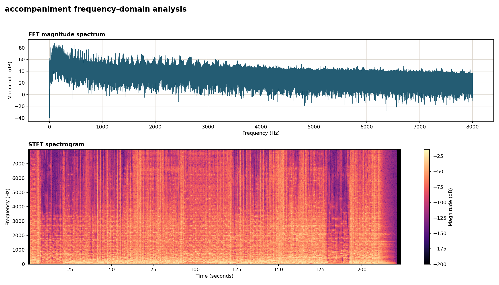
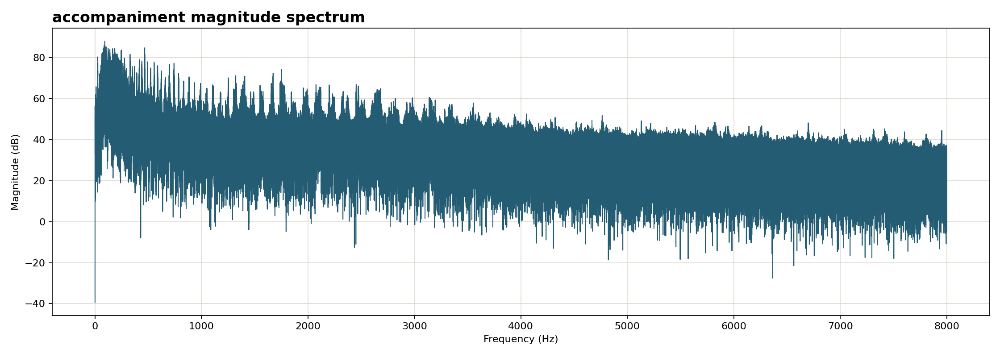
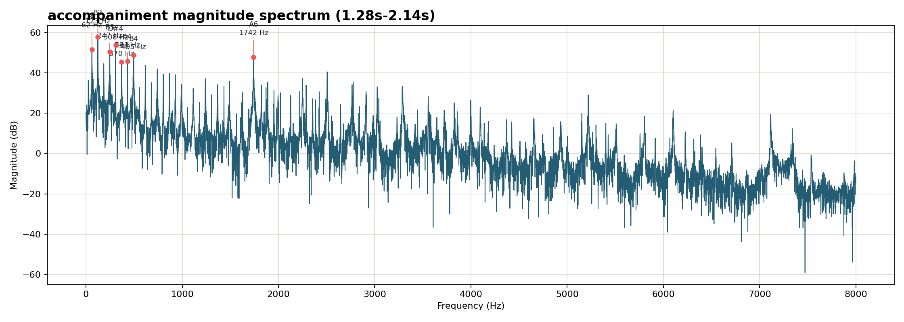

# music-transformer-chords

## Run

Install dependencies:

```bash
python3 -m pip install -r requirements.txt
```

Analyze the default file:

```bash
NUMBA_CACHE_DIR=/tmp/numba_cache python3 main.py
```

Analyze a specific file:

```bash
NUMBA_CACHE_DIR=/tmp/numba_cache python3 main.py input/accompaniment.wav --limit 16
```

Detect chords from harmonic instruments instead of piano alone:

```bash
NUMBA_CACHE_DIR=/tmp/numba_cache python3 main.py input/song.wav --source harmony --limit 16
```

Harmony mode runs Demucs with the `htdemucs_6s` model, then combines these stems for chord detection:

```text
piano.wav + guitar.wav + bass.wav + other.wav -> harmony.wav
```

This is the default source because bass and guitar usually make chord roots clearer than piano-only audio.

## Data Pipeline

The project analyzes an audio file and turns it into chord, rhythm, chart, and report outputs.

```text
Input audio
  -> optional Demucs source separation
  -> audio loading
  -> chroma feature extraction
  -> rhythm detection
  -> chord prediction
  -> beat/bar alignment
  -> reports, graphs, MusicXML, and PDF exports
```

Pipeline steps:

```text
1. Load audio
   services/feature_extractor.py
   librosa loads the audio into numerical samples.

2. Optional source separation
   services/demucs_service.py
   Demucs can create piano-only or harmony stems.

3. Extract features
   services/feature_extractor.py
   Chroma features summarize pitch energy across 12 note classes.

4. Detect rhythm
   services/rhythm_detector.py
   The code estimates tempo, beats, and time signature.

5. Predict chords
   services/chord_predictor.py
   A Transformer checkpoint can predict chords, or the fallback template matcher estimates them from chroma.

6. Align chords to bars
   main.py
   Chord predictions are matched with beat times and grouped into bars.

7. Export results
   services/report_renderer.py     -> browser HTML report
   services/chart_exporter.py      -> Matplotlib graphs
   services/sheet_exporter.py      -> MusicXML and PDF chord charts
```

Main output data shape:

```python
{
    "tempo": 69.84,
    "time_signature": "3/4",
    "source": "mix",
    "aligned_chords": [
        {"bar": 1, "chord": "B", "start": 1.28, "end": 2.14}
    ]
}
```

Inspect piano-only audio when needed:

```bash
NUMBA_CACHE_DIR=/tmp/numba_cache python3 main.py input/song.wav --source piano-only --limit 16
```

Piano-only mode analyzes the generated stem:

```text
separated/htdemucs_6s/song/piano.wav
```

Create a harmony browser GUI report:

```bash
NUMBA_CACHE_DIR=/tmp/numba_cache python3 main.py input/song.wav --source harmony --report chord_report.html
```

The report includes an audio mode switch for inspecting the original full mix, harmony stem, or separated piano-only stem when those files are available.

Export a MusicXML sheet with chord symbols and simple piano chord blocks:

```bash
NUMBA_CACHE_DIR=/tmp/numba_cache python3 main.py input/song.wav --source harmony --export-musicxml chords.musicxml
```

Open the generated `.musicxml` file in MuseScore, Finale, Sibelius, or another notation app to view/export sheet music.

Export a PDF chord chart directly:

```bash
NUMBA_CACHE_DIR=/tmp/numba_cache python3 main.py input/song.wav --source harmony --export-pdf chords.pdf
```

## Graphs

Create a Matplotlib chord timeline:

```bash
python3 main.py input/accompaniment.wav --source mix --export-chart reports/chords.png
```

Create a frequency-domain graph with FFT magnitude and spectrogram:

```bash
python3 main.py input/accompaniment.wav --source mix --export-frequency-chart reports/frequency.png
```

Preview:



Create a magnitude spectrum:

```bash
python3 main.py input/accompaniment.wav --source mix --export-magnitude-spectrum reports/magnitude_spectrum.png
```

Preview:



Create a magnitude spectrum for only the first detected chord:

```bash
python3 main.py input/accompaniment.wav --source mix --first-chord-only --export-magnitude-spectrum reports/first_chord_magnitude_spectrum.png --view events
```

Preview:



Create a browser GUI report:

```bash
NUMBA_CACHE_DIR=/tmp/numba_cache python3 main.py input/accompaniment.wav --report chord_report.html
```

This creates three web files:

```text
chord_report.html  # page structure and chord data
chord_report.css   # visual styles
chord_report.js    # audio/chord interaction logic
```

Use a trained chord model checkpoint:

```bash
NUMBA_CACHE_DIR=/tmp/numba_cache python3 main.py input/accompaniment.wav --checkpoint path/to/model.pt
```

Run tests:

```bash
python3 -m unittest discover -s tests
```
